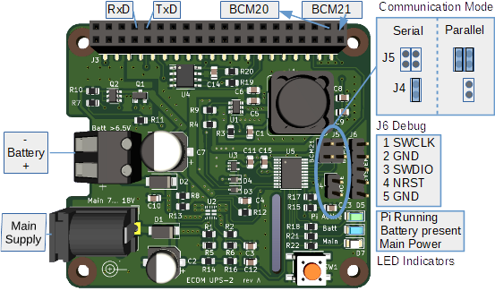

# UPS-2 Uninterruptible Power Supply 

## Hat Solution For Raspberry Pi Computers

UPS-2 is a wide input range, high efficiency power supply for Raspberry Pi computers. It features a main input and a backup input. In case of power fail or under voltage at the main input,  backup input becomes active  with no interruption or spike on the Raspberry 5V, 3A supply output.   
Firmware provides optical and software state feedback, including voltage levels, warnings and CPU temperature.  
UPS-2 can be controlled by software commands from the Raspberry and/or by the on board  push button. Supply commands include POWER OFF, STANDBY and RESTART. 

- Compatible with Raspberry models 3, 3B, 4B and zero W
- High efficiency power supply with output 5V, 3A
- Main input voltage range 6.5V ... 18V
- Shutdown function with real power-off  
- Battery standby current < 8uA @9V
- Battery voltage 6.5V ... 18V
- Nearly no self heating thanks to outstanding conversion efficiency
- Communication with Pi via serial UART or parallel port
- Python library for unattended operation and optional GUI

## Motivation for this project

The Raspberry-Pi series of computers offer an incredible computing power and reliability at very low cost. But there are some serious drawbacks concerning the system reliability for industrial and automation applications.  In my experience, the most important issue is the integrity of data on the SD-Card storage media. Why?

1. There is no power off switch. In order to safely switch of, a software shutdown is required.  This is not a solution in many embedded applications.  --> UPS-2 allows multiple shutdown functions with on simple push-button.
2. In cases of power fail, data on th SD-Card may be lost of even the whole file system becomes corrupt.  --> UPS-2 automatically switches over to a backup power source. 

All development for this project have been realized using open source tools. So I decided to open my ideas and experience to everybody in the form of open source software and hardware.

## Project Components

- [UPS-2  Hat module hardware,](https://github.com/ECOM-Engineering/UPS-2_PowerSupply_HW) developed with [KiCad](https://kicad.org/)
- [UPS-2 hat firmware](https://github.com/ECOM-Engineering/UPS-2_PowerSupply_FW) for power supply written in ANSI C with [STM32CubeIDE](https://www.st.com/en/development-tools/stm32cubeide.html#overview)
- [Raspberry Pi  software](https://github.com/ECOM-Engineering/UPS-2_Raspberry_SW) written in [Python3](https://www.python.org/) and user interface using [PySimpleGUI](http://www.PySimpleGUI.com)

### UPS-2 Hat Module Hardware

**Details in repository** [UPS-2_PowerSupply_HW](https://github.com/ECOM-Klaus/UPS-2_PowerSupply_HW)  

 

### UPS-2 Hat Firmware

Firmware written in C  is running on the hat's STM32G030 CPU for serial or parallel communication with the Raspberry  computer.  
**Find details in repository** [UPS-2_PowerSupply_FW](https://github.com/ECOM-Klaus/UPS-2_PowerSupply_FW.git)

### UPS-2 Raspberry Software

Python scripts for communication with the UPS-2 hat and optionally with user software.  
**Find details in repository** [UPS-2_Raspberry_SW](https://github.com/ECOM-Klaus/UPS-2_Raspberry_SW.git)

(C) 2021 Klaus Mezger, ECOM Engineering