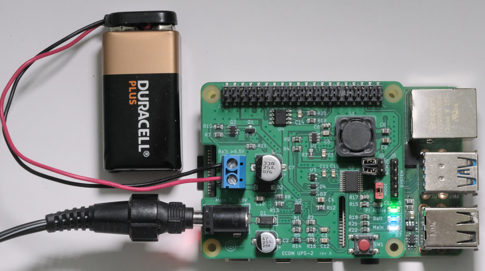
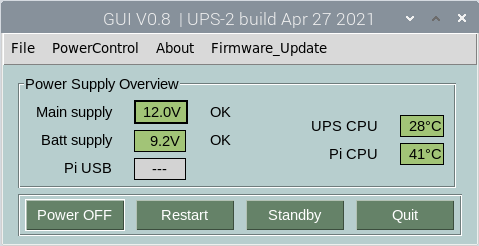
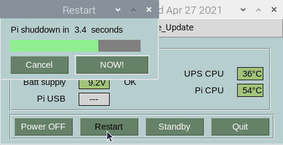
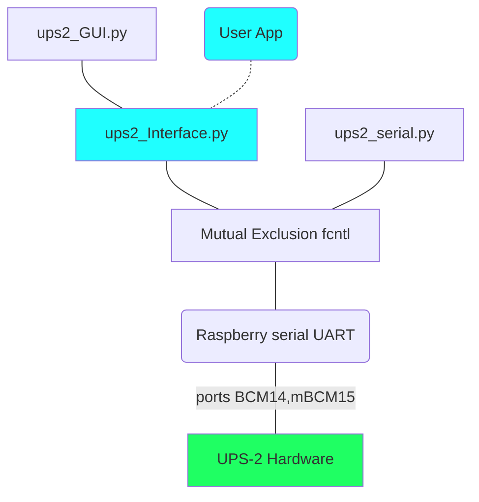

(C) 2021 Klaus Mezger, document licensed under MIT open source license 

# USER MANUAL

# UPS-2 Uninterruptible Power Supply 

## Hat Solution For Raspberry Pi Computers

<figure>
  
    <figcaption><b>UPS-2 UPS-2 with Battery Backup mounted on Raspberry 4B</b></figcaption>
</figure>

UPS-2 is a wide input range, high efficiency power supply for Raspberry Pi computers. It features a main input and a backup input. In case of power fail or under voltage at the main input,  backup input becomes active  with no interruption or spike on the Raspberry 5V, 3A supply output.   
Firmware provides optical and software feedback on operation state, including voltage levels, warnings and CPU temperature.  

## Hardware Technical Data

UPS-2 can be controlled by software commands from the Raspberry and/or by the on-board  push button. Power supply commands include POWER OFF, START, STANDBY, RESTART an Firmware Update. 

- Compatible with Raspberry models 3, 3B, 4B and zero W
- High efficiency power supply with output 5V, 3A
- Main input voltage range 8V ... 18V
- Shutdown function with real power-off  
- Battery quiscent current < 20uA @9V
- Battery voltage 6.5V ... 18V
- Nearly no self heating thanks to outstanding conversion efficiency
- Communication with Pi via serial UART or parallel port
- Python library for unattended operation and optional GUI

## Quick Installation Summary

### UPS-2 Power Supply preparation

### Connector J3 to Raspberry Pi

In the original layout uses a stack through connector. This needs an additional long pin header ([Digikey PN 1528-1783-ND](https://www.digikey.com/en/products/detail/adafruit-industries-llc/1979/6238003?s=N4IgTCBcDaIIwFYwA4C0cDsyDMqByAIiALoC%2BQA) )for the connection to the Raspberry CPU. (included in the hardware bill of material).

### Firmware Installation or Update

There are different possibilities for programming an empty flash. 

- With STM32CubeProgrammer via UART
- With Raspberry-Pi via UART
- With STM32CubeProgrammer via the UPS-2 debug connector

#### Flash with STM32CubeProgrammer via UART

Please download the free [STM32CubeProgammer](https://www.st.com/en/development-tools/stm32cubeprog.html) for programming. You also need a [TTL-232R 3V3](https://www.ftdichip.com/Support/Documents/DataSheets/Cables/DS_TTL-232R_CABLES.pdf) cable from FTDI.

1. Remove UPS-2 hardware from Raspberry-Pi

2. Connect FTDI cable to UPS-2:  
   GND (black wire) to J3 Pin 39;   
   TxD (yellow cable) to J3 Pin 10;  
   Rxd (green cable) to J3 Pin 8;  

3. If  Flash is empty:  
   Apply 9V or 12V power to the UPS-2 Main input -> Green LED lights up dimmed  
   

   Start STM32CubeProgrammer and select FTDI Com Port ( find port number in Windows Device Manager, 'USB serial port'). 

4. Browse for file UPS-2_G030_Vxx.bin and click on 'Start Program' 

#### UPS-2 Firmware Update 

UPS-2 must be already installed and working in order to update the firmware for the UPS-2 microcontroller.

UPS-2 Raspberry Software includes convenient Firmware update scripts. Use the update function of the UPS-2 GUI or without GUI use the update script ups2_update.py. 

Latest stable power supply firmware  [(UPS-2_G030_Vxx.bin)](https://github.com/ECOM-Engineering/UPS-2_PowerSupply_FW/blob/develop/Debug/UPS-2_G030.bin) can be found in the UPS2 github repository.  
Please download it to your UPS-2 directory.

### Raspberry-Pi Preparation

1. Clone or download [UPS-2 Raspberry Software]https://github.com/ECOM-Engineering/UPS-2_Raspberry_SW.git into a Raspberry directory (i.e.  /home/pi/Projects/UPS2) 
2. Install libgpiod library  
    `sudo apt install python3-libgpiod`
3. Activate pullup resistor in file */boot/config.txt* if port BCM20 is free and/or using parallel mode   
   `#set GPIO20 as input with pullup high`  
   `gpio=20=ip,pu`  
4. Activate serial interface in file */boot/config.tx*t if UPS-2 serial mode is used (preferred)  
   `#for UPS2 serial mode `  
   ` 
   enable_uart=1` 
5. If you wish autostart of the UPS-2 GUI add in file */etc/xdg/lxsession/LXDE-pi/autostart*  
   `@python3 /home/pi/Projects/UPS2/ups2_GUI.py`

## Functions

### Hardware Control

#### Power Input Section

| Input                     | Selection                   | Remark                             |
| :------------------------ | --------------------------- | ---------------------------------- |
| Main                      | Selected if > 8V            | Independent of battery voltage     |
| Battery                   | Selected if main input < 7V | Battery voltage > 6.5V             |
| Raspberry USB power input | Selected if present         | Priority over Main and Batt inputs |

#### LED Indicators

| Input Voltage    | White LED: Main | Blue LED: Battery |
| ---------------- | --------------- | ----------------- |
| Voltage in range | ON              | ON                |
| Voltage low      | BLINK           | BLINK             |
| No input         | OFF             | OFF               |

| Raspberry State     | Green LED *) | Raspberry Red LED |
| ------------------- | ------------ | ----------------- |
| Full power OFF      | OFF          | OFF               |
| Standby (shut down) | OFF          | ON                |
| Starting up         | BLINK FAST   | ON                |
| Run (up)            | ON           | ON                |
| Shutting down       | BLINK SLOW   | ON                |

*) Green LED shows also feedback at push button operation 

#### Push Button Operations

Push button allows manual invocation of different shut down and start up functions.

| Button Operation | Function                  | Green LED                |
| ---------------- | ------------------------- | ------------------------ |
| Short press      | Start up from power off   | fast blink               |
| > 2 seconds      | Shutdown to standby *)    | > 2 blinks               |
| > 5 seconds      | Shutdown to power off **) | > 5 blinks               |
| Double click     | Shutdown and restart      | slow blink -> fast blink |

## Hardware Connections

#### UPS-2 Hat <> Raspberry-Pi Connections

All  Pi connections come through the 40 pin connector J3.   
UPS-2 may also be connected with wires instead of stacking on J3. Use at least 2 wires for +5V and GND.

| Signal      | Type | J3 Pin                   | Remark                             | Note |
| ----------- | ---- | ------------------------ | ---------------------------------- | ---- |
| +5V, max 3A | out  | 2, 4                     |                                    |      |
| 0V GND      | -    | 6, 9, 14, 20, 25, 30, 39 |                                    |      |
| RxD         | in   | 8 (BCM14)                | **Serial Mode**: Jumper J4 set     | 1)   |
| TxD         | out  | 10 (BCM15)               | **Serial Mode**: Jumper J4 set     | 1)   |
| Par. out    | out  | 38 (BCM20)               | Parallel Mode: Jumper J5 [1-2] set | 2)   |
| Par in      | in   | 40 (BCM21)               | Parallel Mode: Jumper J5 [2-3] set | 2)   |

Note 1): **Serial mode is preferred**. Leave both jumpers J5 open.   
Note 2): Parallel mode is optional. Leave J4 open. Use serial mode, if not used for other purposes

<figure>
  
    <figcaption><b>UPS-2 Hat connections</b></figcaption>
</figure>

## GUI-Graphical User Interface

The optional UPS-2 GUI is part of the sub-project [UPS-2_Raspberry_SW](https://github.com/ECOM-Engineering/UPS-2_Raspberry_SW.git) .  It allows control of all functions of the Power Supply Hardware. For headless applications, the GUI may be accessed by a VPN client from any device. 

This optional interface ups-2_GUI.py is built with  the [PySimplGUI Library](https://github.com/PySimpleGUI/PySimpleGUI) library. 

<figure>
  
    <figcaption><b>UPS-2 GUI: Main and Battery OK, Main Suppply selected</b></figcaption>
</figure>

<figure>
  
    <figcaption><b>UPS-2 GUI: Restart selected after delay</b></figcaption>
</figure>
[Find more pictures here](../images/))

Note: This interface needs Raspberry Pi operation system including graphical drivers.

## Software API

The UPS-2 Software residing on the Raspberry Computer is divided in 4 parts.

User applications can access UPS2 data and execute commands via the API functions in module ups2_Interface.py. Same interface is used by the graphical interface ups2_GUI. Refer to the source code of  ups2_Interface.py and the example testInterface.py for more information.

For more details refer to [UPS-2_Raspberry_SW](https://github.com/ECOM-Engineering/UPS-2_Raspberry_SW.git)

